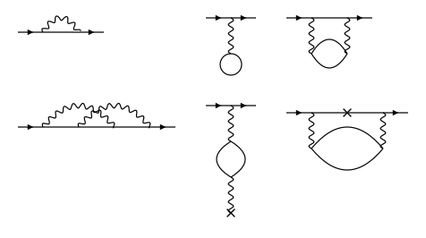

# Goldstoninator

* Constructs Goldstone diagrams from any (valid) chain of one- and two-body integrals.
* Uses Goldstone rules to also construct pertrubation term, including sign and energy denominators
* Can export diagrams as images, or as tikz source code
* Can also parse the pertrubation term into LaTeX 
* `feynmanator.py` draws Feynman diagrams (Green's function, Coulomb and polarisation lines) from a product of propagators, with the same exports: see the [last section](#feynman-diagrams-feynmanatorpy)


## Setup

The module needs Python 3, Jupyter is needed for the notebook.

```sh
python3 -m venv .venv
source .venv/bin/activate
```


## Quick examples

**1. Write the term and show the diagram.** A term is a product of integrals; `t_rm` is a one-body vertex, drawn here as a cross:

```python
import goldstoninator as gd

## Create the diagram:
example = gd.diagram("g_vbrs g_asnb t_rm g_mnva", styles={"t": "cross"})

## Display it as image in a notebook:
display(example)
```


**2. Export the picture**, as a file or straight to TikZ:

```python
example.save("example.pdf")       # pdf output
example.save("example.svg")       # or .svg
example.save("example.tikz")      # tikz source code
example.save("example.tex")       # a standalone document for pdflatex
print(example.tikz())             # or just the TikZ source
```

Wavy lines use the `snake` decoration, so a document that `\input`s the TikZ needs `\usetikzlibrary{decorations.pathmorphing}`. One diagram unit is 1 cm (`unit=` scales it).

**3. The equation**, with sign, numerator and energy denominators, typeset or as source:

```python
example.equation()                # typeset, as the last line of a cell
print(example.tex())              # the LaTeX source
```

$$
+\frac{g_{vbrs}\,g_{asnb}\,t_{rm}\,g_{mnva}}{(\varepsilon_{va}-\varepsilon_{mn})(\varepsilon_{vb}-\varepsilon_{ms})(\varepsilon_{vb}-\varepsilon_{rs}+\omega_t)}
$$

The one-body vertex absorbs an energy ω<sub>t</sub>, which enters the denominators after it (see below).

**4. Several terms at once**, side by side, with the sum of their equations:

```python
g = gd.grid(["t_na g_wavn", "g_wnva t_an"], ncols=2)
g                                 # the pictures
g.equation()                      # the sum; g.tex(), g.tikz(), g.save(...) as above
```

## Reference

### Writing a term

Integrals are written as `g_vbms`, `g_{vbms}`, `g[v,b,m,s]`, or as a list of tuples `[('v','b','m','s'), ...]`.

* Two-body `g_pqrs` = ⟨pq|g|rs⟩: electron r → p and s → q, drawn as a vertical interaction line.
* One-body `h_pr` = ⟨p|h|r⟩: a single vertex (marker), e.g. an external field.
* Letters: core (holes) `a b c d e f`, valence `v w x y`; every other letter is excited (a particle).
  Change them with `core=`, `val=`, `exc=`, or `types=dict(x='core')`.
* Antisymmetrised integrals are not accepted: expand g̃_pqrs = g_pqrs − g_pqsr first.
* Integrals written in the opposite convention (`g_rspq`) are detected: the reading with the fewest flipped integrals is used.

The diagram follows from the numerator alone. Every non-valence letter appears once as an out index (p, q) and once as an in index (r, s); particles are created before they are annihilated and holes are created before they are filled, which fixes the time order.
One or two valence lines are allowed: `g_mnvw g_xymn` has `v`, `w` coming in and `x`, `y` going out (an effective two-body interaction).
Time runs left to right, particle arrows point right and hole arrows left, and the incoming valence line enters at the top left.
Along the valence line, particle lines are drawn horizontal and hole lines slope down to the left; closed loops are placed freely (a bubble is a lens).

### Energy denominators and sign

One denominator per gap between successive vertices: the initial energy ε_v, plus the energies ω absorbed at the vertices before the gap, plus the energies of the hole lines crossing the gap, minus those of the particle lines (external valence legs count as particles).
Each denominator is written with the valence energy first and positive, then ±ω. The sign is (−1)^(hole lines + closed loops), times the sign flips needed for that ordering.
With two valence lines the initial energy is ε_v + ε_w, and the outgoing letters belong to the incoming ones in the order of the valence letters (`v` with `x`, `w` with `y`); a diagram whose open lines connect them the other way round, the exchange diagram, gets an extra minus sign.

A one-body vertex is taken as *absorption* of an energy named after it (`t_rm` absorbs ω_t). The final valence energy never appears: energy conservation ε_w = ε_v + Σω removes it. So the two time orderings of a field vertex give ε_a − ε_n ± ω_t:

```python
gd.grid(["t_na g_wavn", "g_wnva t_an"]).equation()
```

`omega=False` gives a static field (no ω), `omega=r'\omega'` a plain symbol, and `omega={'t': r'\omega', 'S': True}` a symbol per name (any vertex may carry one; `True` means ω with the name as subscript).

### Styles

`styles={'S': 'dotted', 't': 'cross'}` on `diagram` or `grid`, or `gd.STYLES['t'] = 'cross'` for the whole session.
Two-body lines: `wavy` (default for `g`), `doublewavy` (default for `X`; `double-wavy` is read the same), `dashed` (default for other names), `dotted`, `double`, `solid`.
One-body markers: `x` or `cross` (default), `dot`, `circle`, `square`.
`pad=` adds margin around the picture, `labels=False` leaves the orbital labels off it; the energy symbols are `gd.EPS` and `gd.OMEGA`.

## Feynman diagrams (`feynmanator.py`)

The same pictures and files for Feynman diagrams, from a product of propagators. There are no rules to derive, only the drawing (`feynman_draw.ipynb` shows the examples below and more):

```python
import feynmanator as fd

d = fd.diagram("v(1) G(1,2) w(2) Q(1,3) PI(3,4) Q(4,2)")   # second-order direct self-energy
d                                                          # the picture, inline
print(d.tikz()); d.save("fig.pdf")                         # .svg, .pdf, .tikz, .tex as above
fd.grid(["v(1) G(1,2) w(2) Q(1,2)", "v(1) w(1) Q(1,2) G(2,2)"], ncols=2)
```



A factor is `name(label)` or `name(label,label)`; the labels name the vertices, and any letters or digits will do.

* `G(1,2)`: internal line (Green's function), solid, no arrow. `G(1,1)` is a closed loop (tadpole).
* `Gex(1,2)`: the excited part of `G`, a line with two arrowheads; `Pa(1,2)`: the core projector, a double line. Both are fermion lines for the layout (the straight line, the loops), like `G`.
* `Q(1,2)`: Coulomb line, wavy, drawn as a gentle arc; `Qs(1,2)` is a straight one (`curved=False` straightens them all). `Qu(1,2)` and `Qd(1,2)` bend up or down (left or right for a vertical line) when the automatic side is not what you want. Its ends need not touch anything else: `Q(1,2) T(2)` is a line to an external potential.
* `X(1,2)`: a second Coulomb-type line, double wavy (a screened or effective interaction, say), laid out like `Q`; `Xs`, `Xu` and `Xd` as for `Q`.
* `PI(1,2)` (also `Pi`, `\Pi`): polarisation loop, `G(1,2) G(2,1)`, drawn as two arcs that never overlap.
* `v(1)`, `w(2)` (names `v w x y`): external lines, with arrows. The first one written enters at the top left, the second leaves at the right; at most one of each.
* Any other name with one label, `T(1)`, is a marker at that vertex (a cross by default); with two labels, `S(1,2)`, a dashed line. `styles={'T': 'dot', 'S': 'dotted', 'G': 'double'}` changes them, as for Goldstone diagrams. Two more line styles exist here: `arrow` and `arrows`, a solid line with one filled or two open arrowheads at its middle, pointing from the first label to the second.

Nothing is drawn at a plain vertex, and there are no labels.
The vertices are placed on a small grid, the incoming vertex at the top left, the outgoing one at the right and the fermion line between them straight (`straight=False` frees it); every placement is scored (lines through a vertex, overlapping and crossing lines, length, size, bends, tilted bubbles) and the best one is drawn.
Lines between the same two vertices are bent into arcs on alternate sides.
A closed loop of `G` lines is drawn counterclockwise in the direction of propagation (`G(a,b)` runs from b to a), so writing the loop the other way round mirrors it: `G(3,i) t(i) G(i,6) G(6,3)` puts the insertion `i` on the upper line of the loop, `G(3,6) G(6,i) t(i) G(i,3)` on the lower one.
A loop of three or more `G` lines is drawn as the circle through its vertices (a rounded ring for more than three), so an insertion sits on the curve.
`fd.diagram(term).layout(cols=, rows=)` sets the grid when the automatic one is not what you want.
`vertical=('Qi', ...)` forces the lines of those names to run vertically, as in a Goldstone diagram (with `straight=False` when they join two vertices of the fermion line).
