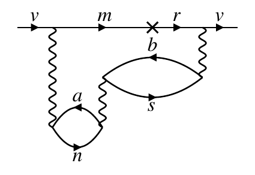
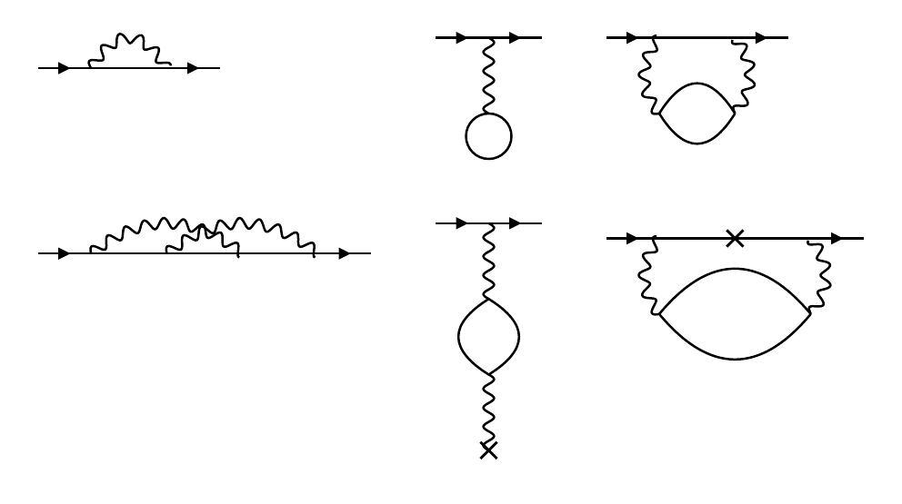
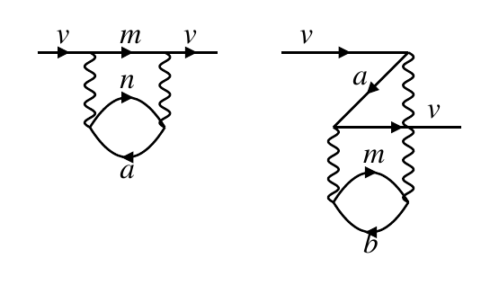
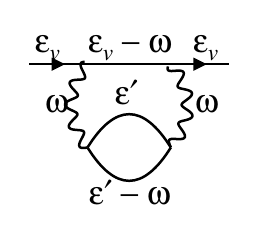

# Goldstoninator

Goldstone and Feynman diagrams for many-body perturbation theory, drawn from a line of text, with the perturbation term that goes with them. Python 3 and nothing else; Jupyter for the notebooks.

* **Goldstone diagrams** (`goldstoninator.py`) from any product of one- and two-body integrals, `g_vbrs g_asnb t_rm g_mnva`. The time ordering follows from the letters: core `a b c d e f`, valence `v w x y`, excited otherwise.
* **The term**: sign, numerator and energy denominators, as LaTeX source or typeset inline. A one-body vertex absorbs an energy ω, which enters the denominators.
* **Two valence lines**, an effective two-body interaction, with the exchange sign.
* **Feynman diagrams** (`feynmanator.py`) from a product of propagators, `v(1) G(1,2) w(2) Q(1,3) PI(3,4) Q(4,2)`: Green's functions (and their excited or core parts), Coulomb lines (and a second, double-wavy kind), polarisation loops (bare or shaded), external fields. The layout is automatic.
* **Energy labels** on a Feynman diagram, from energy conservation at each vertex.
* **Feynman → Goldstone**: every time ordering of a Feynman diagram as a Goldstone diagram, with the sum of their terms.
* **Several diagrams** side by side, with the sum of their terms.
* **Pictures** inline in Jupyter and as SVG, PDF or TikZ files (a `tikzpicture` to `\input`, or a standalone document). Line styles (wavy, double wavy, dashed, dotted, double, solid), markers (cross, dot, circle, square), picture and label sizes.

## Examples

For best/full set of examples, see the notebooks:
 * [goldstone_draw.ipynb](./goldstone_draw.ipynb) for Goldstone examples
 * [feynman_draw.ipynb](./feynman_draw.ipynb) for Feynman examples

### Simple Goldstone demonstration

```python
import goldstoninator as gd

d = gd.diagram("g_vbrs g_asnb t_rm g_mnva")
display(d)
```



```python
# the term as LaTeX, and typeset
print(d.tex())
d.equation()
```

```latex
+\frac{g_{vbrs}\,g_{asnb}\,t_{rm}\,g_{mnva}}{(\varepsilon_{va}-\varepsilon_{mn})(\varepsilon_{vb}-\varepsilon_{ms})(\varepsilon_{vb}-\varepsilon_{rs}+\omega_t)}
```

$$
+\frac{g_{vbrs} g_{asnb} t_{rm} g_{mnva}}{(\varepsilon_{va}-\varepsilon_{mn})(\varepsilon_{vb}-\varepsilon_{ms})(\varepsilon_{vb}-\varepsilon_{rs}+\omega_t)}
$$

### Simple Feynman demonstration

```python
import feynmanator as fd

fd.diagram(["v(1) G(1,2) w(2) Q(1,2)", "v(1) w(1) Qs(1,2) G(2,2)", "v(1) G(1,2) w(2) Q(1,3) PI(3,4) Q(4,2)",
            "v(1) G(1,2) G(2,3) G(3,4) w(4) Q(1,3) Q(2,4)", "v(1) w(1) Qs(1,2) PI(2,3) Qs(3,4) T(4)",
            "v(1) G(1,i) t(i) G(i,2) w(2) Q(1,3) PI(3,6) Q(6,2)"], ncols=3)
```



```python
# its Goldstone diagrams, one per time ordering
g = fd.goldstone("v(1) G(1,2) w(2) Q(1,3) PI(3,4) Q(4,2)")
g
```



```python
# and their sum
print(g.tex())
g.equation()
```

```latex
+\frac{g_{mnva}\,g_{avnm}}{(\varepsilon_{va}-\varepsilon_{mn})}
+\frac{g_{mvba}\,g_{abvm}}{(\varepsilon_{vm}-\varepsilon_{ab})}
```

$$
\begin{aligned}
&+\frac{g_{mnva} g_{avnm}}{(\varepsilon_{va}-\varepsilon_{mn})} \\
&+\frac{g_{mvba} g_{abvm}}{(\varepsilon_{vm}-\varepsilon_{ab})}
\end{aligned}
$$

```python
# with the energy of every line
fd.diagram("v(1) G(1,2) w(2) Q(1,3) PI(3,4) Q(4,2)", energies=True)
```


